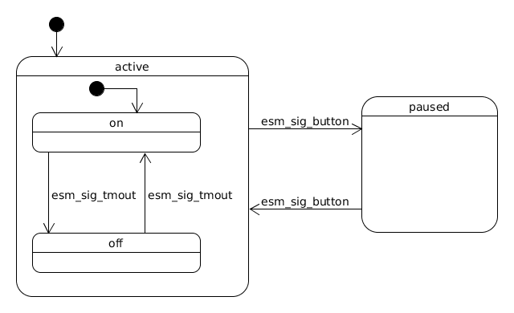

Efficient State Machine framework
=================================


Introduction
------------
Good system design is often about knowing what to avoid.
Unrestricted use of traditional techniques for writing concurrent software, like preemptive threading, almost always
results in systems that are unpredictable and unreliable. Degradation of those two aspects
is specially problematic in embedded systems where predictability and reliability are even
more important than performance and/or expressiveness.

**Active Object Model** brings the same improvements to behavioral design as
**Object Orientation** to architectural design. Active objects are objects that encapsulate own flow of control and
are designed as message pumps with **Run-to-completion** (RTC) semantics and explicit state machine structure.

Adapting **Active Object Model** allows for construction of comprehensible concurrent programs.
Resulting conceptual integrity has also added benefit of making it possible to spend effort on design instead of implementation.
Implementation step in this method is, for the most part, mechanical process and as such, can be automated.

This repository gathers all the ideas and implementation tricks around lightweight, efficient
statecharts and AOM implementation in C. Inspired by [QP framework](https://state-machine.com/doc/concepts).
It's basically a simple cooperative priority-based scheduler and a (hierarchical) state machine framework.
Some implementation techniques and design patterns (like 'Embedded Anchor' and linker-section-based 'plugin' system) are borrowed from Linux kernel.

Another interesting feature is the possibility of running the system without delays, so as fast as possible.
Having the inputs defined explicitly makes mocking them out easy and then linking with the `test` platform
produces a binary that can generate an execution log containing days worth of system operation in seconds.
Then it's easy to analyze the log (e.g. in an Excel spreadsheet) for safety/liveness properties.
Sort of poor man's model checker :smiley:.

Provided are following examples/demos:
 - [simple blink](apps/blink) - hierarchical state machine transitioning between two states and reacting to a button press
 - [Dining Philosophers Problem (DPP)](apps/dpp) - originally formulated in 1965 by Edsger Dijkstra
 - [cigarette smokers problem](apps/smokers) - classical problem originally described in 1971 by Suhas Patil
 - [pelican crossing simulation](apps/pelican) - simplest safety-critical system simulation
 - [producer-consumer simulation](apps/prodcons) - two producers requesting actions on a single resource guarded by a 'bus' module

There are also two more complex apps:
 - [sk6812 LED strip mood lamp and clock](apps/clock) with RTTTL alarms and sunrise simulator
 - [USB HID keyboard firmware](apps/keyboard) - more lightweight QMK alternative

Simplest Example
----------------



```c
// Blink state machine configuration structure
// It's kept in read-only memory and holds the delay
// the machine will stay in state before transitioning to another

typedef struct {
	const uint32_t delay;
} blink_cfg_t;

// Structure representing the machine object (active object)
// Timer is used to schedule timeout signal on which machine changes state

typedef struct {
	hesm_t esm;
	esm_timer_t timer;
	blink_cfg_t const *const cfg;
} blink_esm_t;

// Define two states (state structures) 'on' and 'off'

ESM_DEFINE_STATE(on);
ESM_DEFINE_STATE(off);

// Entry action of 'on' state:
// - run action corresponding to turning the LED on
// - schedule a timer signal with configured delay

static void esm_on_entry(esm_t *const esm)
{
	blink_esm_t *self = ESM_CONTAINER_OF(esm, blink_esm_t, esm);

	BOARD_LED_ON();

	esm_signal_t sig = {
			.type = esm_sig_tmout,
			.sender = esm,
			.receiver = esm
	};
	esm_timer_add(&self->timer,
			self->cfg->delay, &sig);
}

// Signal handler of 'on' state
// - on 'timeout' signal transition to 'off' state

static void esm_on_handle(esm_t *const esm, const esm_signal_t * const sig)
{
	switch(sig->type)
	{
	case esm_sig_tmout:
		ESM_TRANSITION(off);
		break;
	default:
		ESM_TRANSITION(unhandled);
		break;
	}
}

// Entry action of 'off' state:
// - run action corresponding to turning the LED off
// - schedule a timer signal with configured delay

static void esm_off_entry(esm_t *const esm)
{
	blink_esm_t *self = ESM_CONTAINER_OF(esm, blink_esm_t, esm);

	BOARD_LED_OFF();

	esm_signal_t sig = {
			.type = esm_sig_tmout,
			.sender = esm,
			.receiver = esm
	};
	esm_timer_add(&self->timer,
			self->cfg->delay, &sig);
}

// Signal handler of 'off' state
// - on 'timeout' signal transition to 'on' state

static void esm_off_handle(esm_t *const esm, const esm_signal_t * const sig)
{
	switch(sig->type)
	{
	case esm_sig_tmout:
		ESM_TRANSITION(on);
		break;
	default:
		ESM_TRANSITION(unhandled);
		break;
	}
}

// Configuration structure of machine instance 'blink_1'

static const blink_cfg_t blink_1_cfg = {
		.delay = 300UL
};

// Register instance 'blink_1' of the blink machine with the framework
// Last argument is the input signals queue length

ESM_REGISTER(blink, blink_1, esm_gr_none, 1);
```

Recommended reading
-------------------

Books:

- [Practical UML Statecharts in C/C++, 2nd Edition:
Event-Driven Programming for Embedded Systems](https://www.state-machine.com/psicc2/)

- [Introduction to Embedded Systems](http://leeseshia.org/releases/LeeSeshia_DigitalV2_2.pdf)

Articles:

- [STATECHARTS: A VISUAL FORMALISM FOR COMPLEX SYSTEMS](http://www.inf.ed.ac.uk/teaching/courses/seoc/2005_2006/resources/statecharts.pdf)

- [Managing Concurrency in Complex Embedded Systems](https://www.state-machine.com/doc/Cummings2006.pdf) - also all the articles from [here](https://www.state-machine.com/doc/an#Active)

- [Problem with threads](https://www2.eecs.berkeley.edu/Pubs/TechRpts/2006/EECS-2006-1.pdf)

Build instructions
------------------

Standard CMake routine with some configuration options.
Currently most extensively tested with:

```sh
cmake version 3.10.2
arm-none-eabi-gcc (15:6.3.1+svn253039-1build1) 6.3.1 20170620
libnewlib-arm-none-eabi 2.4.0.20160527-3ubuntu0.1
```

Project setup for native Linux:

```sh
mkdir build
cd build
cmake -DCMAKE_BUILD_TYPE=Debug ..
```

Project setup for test mode on Linux:

```sh
mkdir build
cd build
cmake -DCMAKE_BUILD_TYPE=Debug -DESM_PLATFORM=test -DESM_BOARD=native ..
```

For STM32 target ([bluepill board](http://wiki.stm32duino.com/index.php?title=Blue_Pill)):

```sh
mkdir build
cd build
cmake -DCMAKE_BUILD_TYPE=Release -DESM_PLATFORM=stm32 -DESM_BOARD=bluepill \
      -DCMAKE_TOOLCHAIN_FILE=../platform/stm32/Toolchain.cmake ..
```

Build step:
```sh
make
```

TODO
----
  - [x] adding hierarchical state machine support
  - [x] add proper platform (BSP) separation
  - [x] change to more flexible build system (CMake)
  - [x] evaluate usefulness of publish-subscribe (efficient implementation limits signal types to 31)
  - [x] switch from array to list in main scheduler loop
  - [x] research and implement efficient priority support
  - [ ] add more examples
  - [ ] handle timer rollover
  - [ ] add automatic tests

License
-------
  - MPLv2

Contact
-------
If you have questions, contact Mariusz Ryndzionek at:

<mryndzionek@gmail.com>
